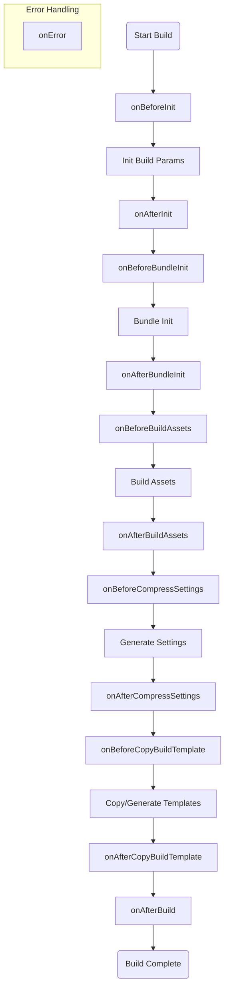

# Cocos CLI Build Platform Adapter Development Guide

Cocos CLI supports extending build platforms through plugin packages. Developers can create custom platform adapter packages and place them in the `packages/platforms` directory, where the CLI will automatically scan and load them.

## 1. Basic Structure

A standard platform adapter package should contain a `package.json` file and declare the `contributes.builder` field within it. The reason for using `contributes` instead of the `contribution` field used previously in Cocos Creator is that `contributes` is a field for VSCode's extension mechanism, and this field may continue to be used within editor extensions in the future.

**Directory Structure Example:**

```text
[platform]/
├── package.json    # Plugin description file, containing registration information
├── adapter/        # Platform adapter (optional, usually required for native and mini-game platforms)
├── i18n/           # Internationalization files (optional)
├── dist/           # Compiled output directory
│   ├── config.js   # Build configuration
│   └── hooks.js    # Build hooks
├── src/            # Source directory
│   ├── config.ts
│   └── hooks.ts
└── static/         # Static resource templates (optional, prepared according to actual hook needs)
```

**package.json Configuration:**

```json5
{
    "name": "[platform]",
    "version": "1.0.0",
    "contributes": {
        "builder": {
            "register": true,              // Must be true, identifying this as a platform registration plugin
            "platform": "[platform]",      // Platform identifier, must be globally unique
            "config": "./dist/config",     // Path to the build configuration module (CommonJS)
            "hooks": "./dist/hooks"        // Path to the build hooks module (CommonJS)
        }
    }
}
```

## 2. Build Configuration (Config)

The `config` module is used to define platform-specific build options, validation rules, and overrides for common options. It needs to default export (`export default`) an object that conforms to the `IPlatformBuildPluginConfig` interface.

**Example (`src/config.ts`):**

```typescript
import { IPlatformBuildPluginConfig } from '@cocos/cocos-cli-types/builder';

const config: IPlatformBuildPluginConfig = {
    displayName: '[Platform Name]', // Name displayed in the build panel
    platformType: 'HTML5',       // Platform macro type (HTML5, WINDOWS, etc.)

    // Platform-specific build options
    options: {
        orientation: {
            label: 'Screen Orientation',
            default: 'auto',
            type: 'enum',
            items: ['auto', 'landscape', 'portrait'],
        },
        appid: {
            label: 'AppID',
            default: '',
            type: 'string',
            verifyRules: ['required'], // Validation rules
        }
    },

    // Override default values for common build options
    commonOptions: {
        polyfills: {
            default: {
                asyncFunctions: true,
            },
        },
    },
    
    // Texture compression configuration, used to configure the list of supported formats by default, so unsupported formats are automatically excluded during build
    textureCompressConfig: {
        platformType: 'mini-game',
        support: {
            rgb: ['etc2_rgb', 'astc_4x4'],
            rgba: ['etc2_rgba', 'astc_4x4'],
        },
    },
};

export default config;
```

### Key Fields Description

* **displayName**: The platform name displayed in the build panel.
* **platformType**: The base type of the platform, which affects how the engine is loaded and macro definitions.
* **options**: Defines build parameters unique to this platform, supporting attributes like `type` (string, boolean, number, enum, array, object), `default`, `label`, `description`, `verifyRules`, etc.
* **commonOptions**: Used to modify or override default values or validation rules for CLI common build options (such as `outputName`, `mainBundleCompressionType`, etc.).
* **verifyRuleMap**: Custom parameter validation rules.

## 3. Build Hooks (Hooks)

The `hooks` module exports a series of lifecycle functions to intervene in various stages of the build process.

**Supported Hook Functions:**

| Hook Name | Description |
| :--- | :--- |
| `onBeforeInit` | Before build initialization, can be used to modify initial build parameters |
| `onAfterInit` | After build initialization, parameters are ready, can be used to modify some internal parameters generated after initialization, such as `buildEngineParam`, etc. |
| `onBeforeBundleInit` | Before Bundle build initialization, triggered by both independent Bundle builds and regular builds |
| `onAfterBundleInit` | After Bundle build initialization |
| `onBeforeBuildAssets` | Before asset build |
| `onAfterBuildAssets` | After asset build |
| `onBeforeCompressSettings` | Before compression settings preparation, can be used to modify `result.settings` |
| `onAfterCompressSettings` | After compression settings preparation |
| `onBeforeCopyBuildTemplate` | Before copying build templates, commonly used to generate platform-specific template files (e.g., `index.html`, `game.js`) |
| `onAfterCopyBuildTemplate` | After copying build templates |
| `onAfterBuild` | End of the build flow, can be used to generate configuration files (e.g., `project.config.json`) or handle final output |
| `onError` | Triggered when a build error occurs |
| `run` | (Optional) Implements the logic for the `run` command, used to run the built project |

> Note: The specific data content of input parameters obtained in hook functions varies at different times. The interface definition cannot accurately describe all possible input parameter situations. For example, before `onBeforeInit`, some built-in parameters have not yet been generated and cannot be accessed. Please choose the appropriate hook function to modify according to actual needs. For more process details, refer to the source code implementation [`src/core/builder/worker/builder/index.ts`](../../src/core/builder/worker/builder/index.ts). Please try to use methods like modifying build parameters and calling public methods to influence the build result instead of directly manipulating files, unless it is indeed impossible to satisfy the requirements, to avoid failure to get correct update prompts through definitions after version upgrades.

**Hooks Lifecycle Flowchart:**



**Example (`src/hooks.ts`):**

```typescript
import { IInterBuildTaskOption, InternalBuildResult, BuilderCache, IBuilder } from '@cocos/cocos-cli-types/builder';
import { join } from 'path';
import { outputFileSync } from 'fs-extra';

export async function onAfterInit(options: IInterBuildTaskOption, result: InternalBuildResult, cache: BuilderCache) {
    // Modify engine build parameters
    options.buildEngineParam.split = false;
}

export async function onAfterBuild(this: IBuilder, options: IInterBuildTaskOption, result: InternalBuildResult) {
    // Generate platform configuration file
    const configPath = join(result.paths.dir, 'config.json');
    outputFileSync(configPath, JSON.stringify({
        appid: options.packages['my-platform'].appid
    }));
    
    console.log('Build success!');
}
```
