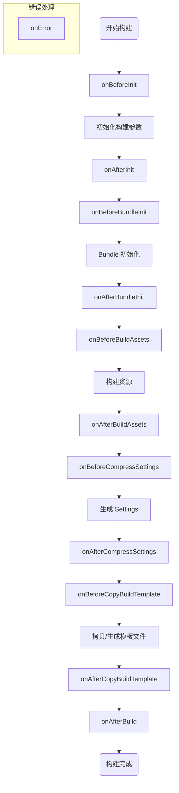

# Cocos CLI 构建平台适配包开发指南

Cocos CLI 支持通过插件包的形式扩展构建平台。开发者可以开发自定义的平台适配包，将其放置在 `packages/platforms` 目录下，CLI 会自动扫描并加载。

## 1. 基础结构

一个标准的平台适配包应包含 `package.json` 文件，并在其中声明 `contributes.builder` 字段。之所以使用 `contributes` 而不是之前 Cocos Creator 使用的 `contribution`，主要是因为 `contributes` 是 VSCode 的扩展机制字段，后续这个字段将可能继续在编辑器扩展内使用。

**目录结构示例:**

```text
[platform]/
├── package.json    # 插件描述文件，包含注册信息
├── adapter/        # 平台适配器（可选，通常原生和小游戏平台需要）
├── i18n/           # 多语言文件（可选）
├── dist/           # 编译后的输出目录
│   ├── config.js   # 构建配置
│   └── hooks.js    # 构建钩子
├── src/            # 源码目录
│   ├── config.ts
│   └── hooks.ts
└── static/         # 静态资源模板（可选，按照 hooks 实际需求准备）
```

**package.json 配置:**

```json5
{
    "name": "[platform]",
    "version": "1.0.0",
    "contributes": {
        "builder": {
            "register": true,              // 必须为 true，标识这是一个平台注册插件
            "platform": "[platform]",      // 平台标识符，需全局唯一
            "config": "./dist/config",     // 指向构建配置模块 (CommonJS)
            "hooks": "./dist/hooks"        // 指向构建钩子模块 (CommonJS)
        }
    }
}
```

## 2. 构建配置 (Config)

`config` 模块用于定义平台特有的构建选项、校验规则以及通用选项的覆盖。它需要默认导出 (`export default`) 一个符合 `IPlatformBuildPluginConfig` 接口的对象。

**示例 (`src/config.ts`):**

```typescript
import { IPlatformBuildPluginConfig } from '@cocos/cocos-cli-types/builder';

const config: IPlatformBuildPluginConfig = {
    displayName: '[Platform Name]', // 构建面板显示的名称
    platformType: 'HTML5',       // 平台宏类型 (HTML5, WINDOWS 等)，用于引擎的宏剔除等

    // 平台特有的构建选项，配置规则与 JSON Schema 的定义规则一致
    options: {
        orientation: {
            label: '屏幕方向',
            default: 'auto',
            type: 'enum',
            items: ['auto', 'landscape', 'portrait'],
        },
        appid: {
            label: 'AppID',
            default: '',
            type: 'string',
        }
    },

    // 覆盖通用构建选项的默认值
    commonOptions: {
        polyfills: {
            default: {
                asyncFunctions: true,
            },
        },
    },
    
    // 纹理压缩配置，用于配置默认支持的格式列表，这样在构建时会自动剔除不支持的格式
    textureCompressConfig: {
        platformType: 'mini-game',
        support: {
            rgb: ['etc2_rgb', 'astc_4x4'],
            rgba: ['etc2_rgba', 'astc_4x4'],
        },
    },
};

export default config;
```

### 关键字段说明

* **displayName**: 在构建面板中显示的平台名称。
* **platformType**: 平台的宏定义，必填项，用于脚本、引擎编译过程的宏剔除等
* **options**: 定义该平台独有的构建参数，支持 `type` (string, boolean, number, enum, array, object), `default`, `label`, `description`, `verifyRules` 等属性。
* **commonOptions**: 用于修改或覆盖构建通用构建选项（如 `outputName`, `mainBundleCompressionType` 等）的默认值或隐藏一些不支持的选项。

## 3. 构建钩子 (Hooks)

`hooks` 模块导出一系列生命周期函数，用于介入构建流程的各个阶段。

**支持的钩子函数:**

| 钩子名称 | 说明 |
| :--- | :--- |
| `onBeforeInit` | 构建初始化之前，可用于修改初始构建参数 |
| `onAfterInit` | 构建初始化之后，参数已准备就绪，可用于修改一些初始化后生成的内置参数，比如 `buildEngineParam` 等 |
| `onBeforeBundleInit` | Bundle 构建初始化前，独立构建 Bundle 和常规构建都会触发此流程 |
| `onAfterBundleInit` | Bundle 构建初始化后 |
| `onBeforeBuildAssets` | 资源构建之前 |
| `onAfterBuildAssets` | 资源构建之后 |
| `onBeforeCompressSettings` | 压缩配置准备之前，可用于修改 `result.settings` |
| `onAfterCompressSettings` | 压缩配置准备之后 |
| `onBeforeCopyBuildTemplate` | 拷贝构建模板之前，常用于生成平台特定的模板文件 (如 `index.html`, `game.js`) |
| `onAfterCopyBuildTemplate` | 拷贝构建模板之后 |
| `onAfterBuild` | 构建流程结束，可用于生成配置文件 (如 `project.config.json`) 或处理最终输出 |
| `onError` | 构建出错时触发 |
| `run` | (可选) 实现 `run` 命令的逻辑，用于运行构建后的项目 |

> 注意：不同时期的钩子函数中得到的入参具体数据内容有所不同，接口定义并无法准确描述所有可能的入参情况，例如在 `onBeforeInit` 之前一些内置参数尚未生成，无法访问到。请根据实际需求选择合适的钩子函数进行修改，更多的流程细则可以参考源码实现 [`src/core/builder/worker/builder/index.ts`](../../src/core/builder/worker/builder/index.ts)。请尽量使用修改构建参数、调用公开方法的方式，来影响构建结果方式而不是直接去操作文件，除非确实无法满足满足，以避免版本升级后无法通过定义提示得到正确的更新提示。

**Hooks 生命周期流程图:**



**示例 (`src/hooks.ts`):**

```typescript
import { IInterBuildTaskOption, InternalBuildResult, BuilderCache, IBuilder } from '@cocos/cocos-cli-types/builder';
import { join } from 'path';
import { outputFileSync } from 'fs-extra';

export async function onAfterInit(options: IInterBuildTaskOption, result: InternalBuildResult, cache: BuilderCache) {
    // 修改引擎构建参数
    options.buildEngineParam.split = false;
}

export async function onAfterBuild(this: IBuilder, options: IInterBuildTaskOption, result: InternalBuildResult) {
    // 生成平台配置文件
    const configPath = join(result.paths.dir, 'config.json');
    outputFileSync(configPath, JSON.stringify({
        appid: options.packages['my-platform'].appid
    }));
    
    console.log('Build success!');
}
```
